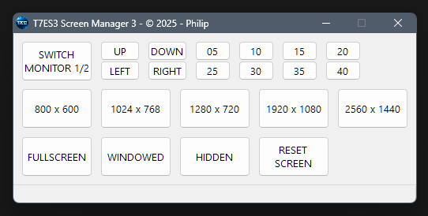

# t7es3-screen-manager-advanced

Instructions:
Just run the t7es3sma.exe.

Features:
- move screen to another monitor.
- play with multiple display resolutions.
- position screen in variable steps.

> For the Tekken7 games I always set my display resolution to 1920x1080, both on my main and second monitor.                    

                

---

                 

                    
**[RobertoTorino](https://github.com/RobertoTorino)**                   
